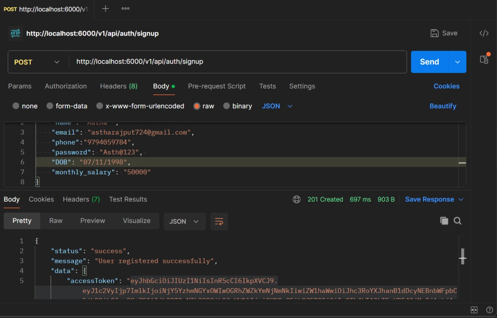
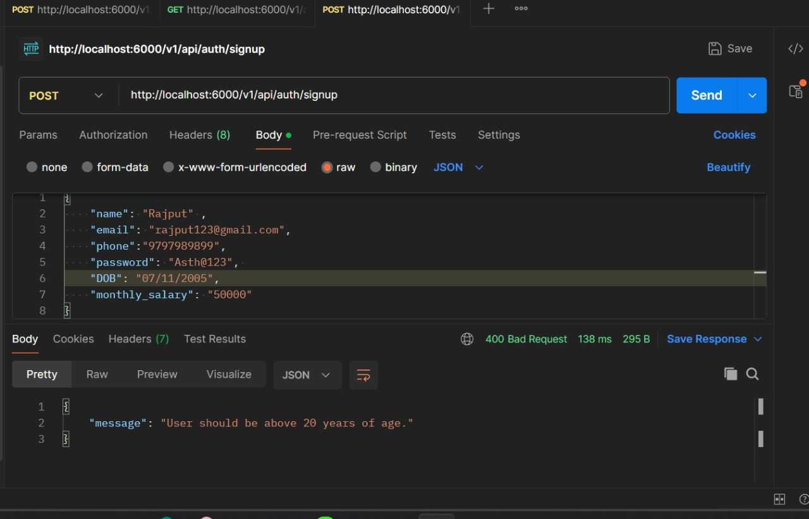
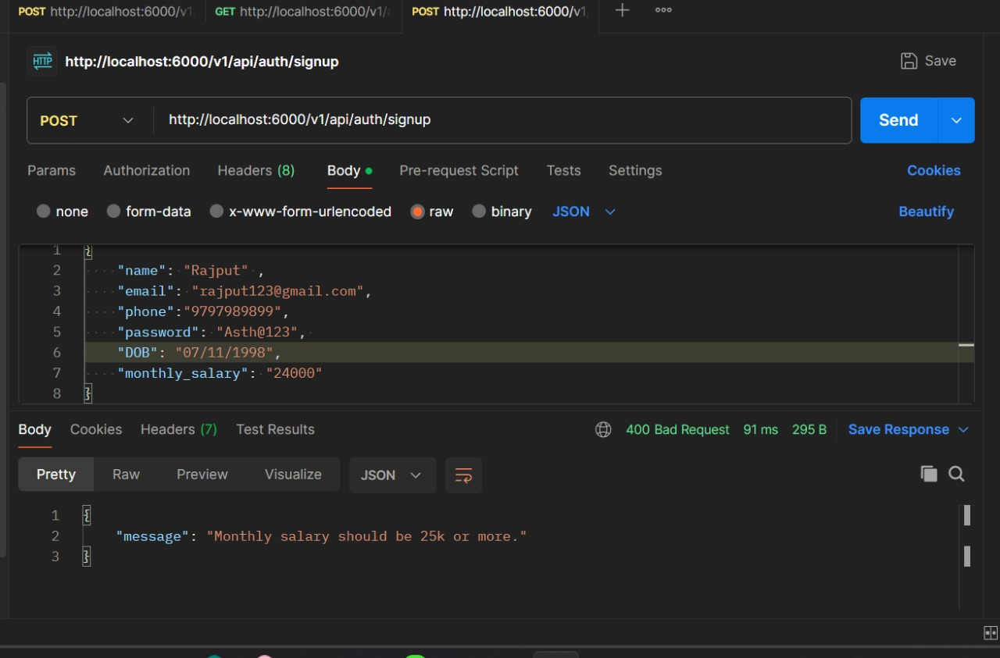
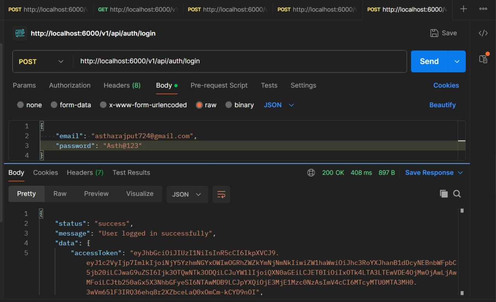
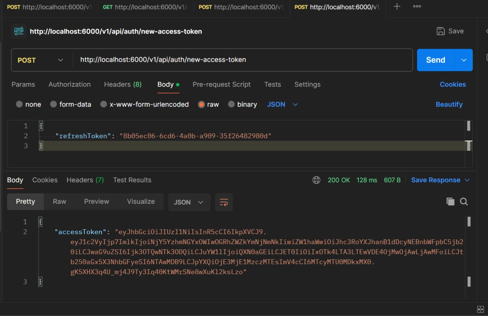
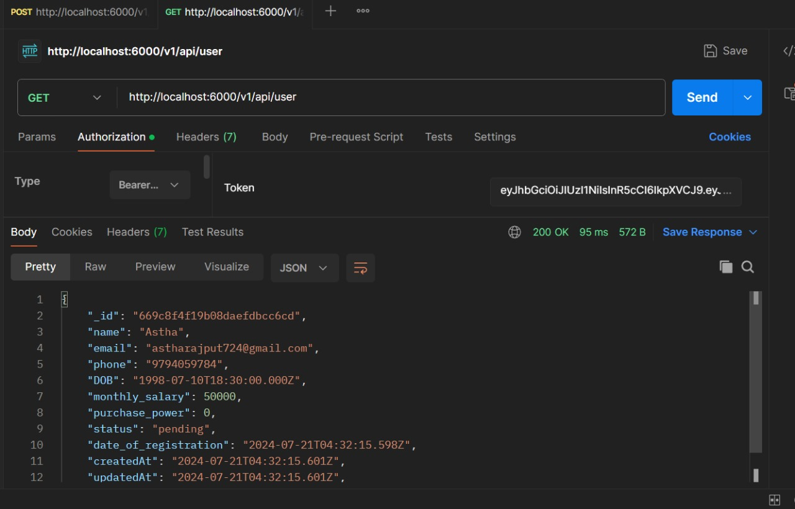
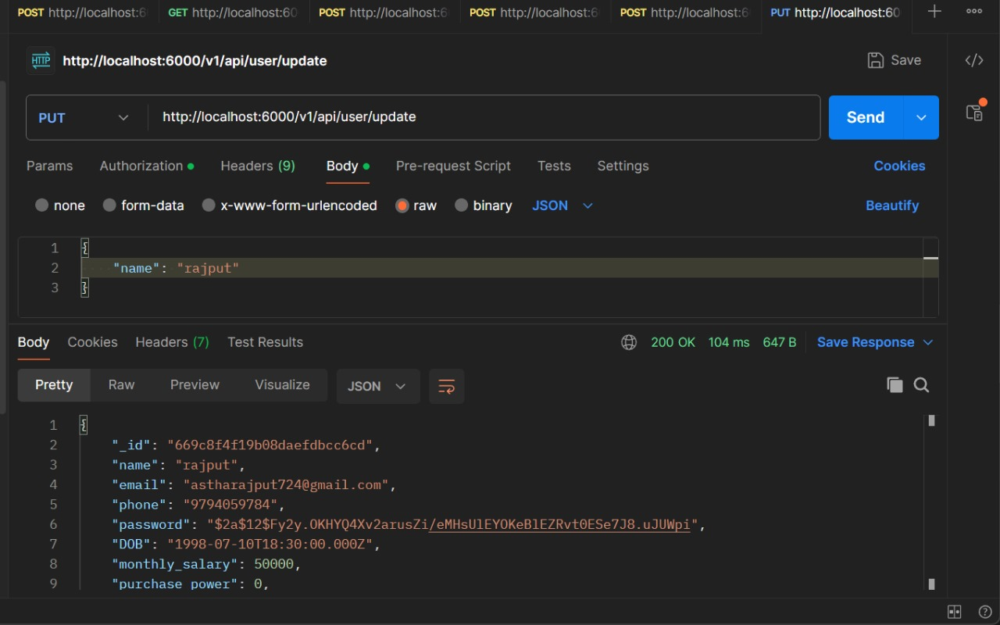
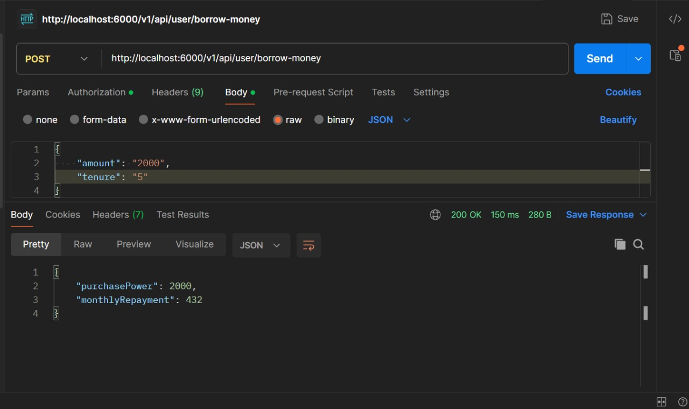

# Backend Money Lending Application

## Overview

This backend application for a money lending system is built with Node.js, Express, and MongoDB. It provides user authentication, profile management, and functionality for borrowing money with repayment calculations.

## Features

- **User Authentication**: Register and log in users with JWT-based authentication, including password hashing and salting. 

- **Token Refresh**: Generate a new access token using a refresh token. Refresh tokens are used to maintain user sessions.

- **Protected Routes**: Protected routes are available for authenticated users. Users must include a valid access token in the request headers to access these routes.

- **Profile Management**: View and update user profile information.
- **Borrowing Money**: Calculate monthly repayments for borrowed amounts.

## Setup

### Prerequisites

- Node.js
- MongoDB
- Postman (for testing API endpoints)

### Installation

1. **Clone the Repository**

   ```bash
   git clone <repository-url>
   cd backend_money_lending

2. **Install Dependencies**

   ```bash
   npm install

3. **Set Environment Variables**

   Create a `.env` file in the root directory and add the following environment variables:

   ```env
    PORT=6000
    MONGO_URI=<your-mongodb-uri
    JWT_SECRET=<your-jwt-secret>

4. **Start the Server**

   ```bash
   npm start

   The server will start at `http://localhost:6000`.

## API Endpoints
1. **Authentication Routes**

   - POST http://localhost:6000/v1/api/auth/signup  
     Sign Up
       
     Sign Up Age Validation  
       
     Sign Up Salary Validation  
     

   - POST http://localhost:6000/v1/api/auth/login  
     Log In
     

   - POST http://localhost:6000/v1/api/auth/new-access-token  
    New Access Token through refresh token 
     
2. **Profile Routes**

   - GET http://localhost:6000/v1/api/user
   Get User Details
   


   - PUT http://localhost:6000/v1/api/user/update
    Update User  Details
   

3. **Borrowing Routes**

   - POST http://localhost:6000/v1/api/user/borrow-money
   Borrow Money
   

## Copyright
Copyright (c) 2024 by Astha Rajput